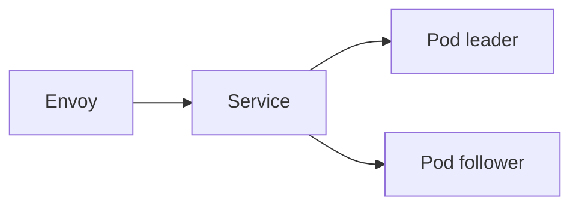

# Installation

This guide covers installing the kubeWAF operator on a Kubernetes cluster.

## Prerequisites

- Kubernetes **1.25+**
- `kubectl` and **Helm 3.8+**
- A data plane you will protect:
  - **Envoy Gateway** (recommended starting point), and/or  
  - **Istio**, and/or  
  - **Cilium** (CEC slot; Wasm enforcement depends on build)

## Recommended: Helm

```bash
helm repo add kubewaf https://kubewaf-io.github.io/charts
helm repo update

helm install kubewaf kubewaf/kubewaf \
  --namespace kubewaf-system \
  --create-namespace \
  --set dataplane.modsecurityWasmSourceURL=https://example.com/modsecurity-proxy-wasm.wasm \
  --set dataplane.challengeWasmSourceURL=https://example.com/challenge-proxy-wasm.wasm
```

!!! important "Wasm modules"
    Envoy fetches Wasm over HTTP. Provide source URLs **or** mount files under
    `/wasm` for **modsecurity-proxy-wasm** and optional **challenge** (PoW).
    Monorepo: `make wasm-build` → `dist/wasm/`.  
    See [Wasm engines](../guides/engines.md) and [Data plane](../guides/dataplane-ecds.md#wasm-binary-delivery-multi-module).

### Verify

```bash
kubectl get pods -n kubewaf-system
kubectl get svc -n kubewaf-system
kubectl get crd | grep -E 'kubewaf|seclang'
```

Pods should be Ready (default **2 replicas**). Service should expose:

| Port | Name | Purpose |
|------|------|---------|
| 18001 | ecds | ECDS gRPC |
| 5005 | extension | Envoy Gateway Extension Server |
| 18002 | wasm | Multi-module `.wasm` HTTP |

CRDs:

- `secrules.seclang.kubewaf.io`
- `secactions.seclang.kubewaf.io`
- `rulesets.waf.kubewaf.io`
- `wafs.waf.kubewaf.io`
- `wafinstances.waf.kubewaf.io`

### Envoy Gateway only: enable Extension Server

After install, configure Envoy Gateway to call kubeWAF on port **5005**.
See [Envoy Gateway guide](../guides/envoy-gateway.md#configure-envoy-gateway-extension-server).

## Helm values overview

```yaml
replicaCount: 2

leaderElection:
  enabled: true

podDisruptionBudget:
  enabled: true
  minAvailable: 1

dataplane:
  ecds:
    port: 18001
  extensionServer:
    port: 5005
  wasmServe:
    port: 18002
  # Product modules (paths or source URLs)
  modsecurityWasmFile: "/wasm/modsecurity-proxy-wasm.wasm"
  challengeWasmFile: "/wasm/challenge-proxy-wasm.wasm"
  modsecurityWasmSourceURL: ""
  challengeWasmSourceURL: ""

image:
  registry: ghcr.io
  repository: kubewaf-io/kubewaf
  tag: ""

args:
  logLevel: 4
```

Full reference: [charts/kubewaf/values.yaml](https://github.com/kubewaf-io/kubewaf/blob/main/charts/kubewaf/values.yaml).

## HA notes



- Every pod serves ECDS + wasm + EG hooks  
- Leader writes status and platform slots  
- See [Architecture · Multi-replica](../concepts/architecture.md#operator-internals)

## Alternative: kustomize

```bash
kubectl apply -k https://github.com/kubewaf-io/kubewaf/config/crd
kubectl apply -k https://github.com/kubewaf-io/kubewaf/config/default
```

You must expose dataplane ports and pass wasm flags yourself; Helm is preferred.

## Upgrading

```bash
helm upgrade kubewaf kubewaf/kubewaf -n kubewaf-system
```

If upgrading from versions that created `EnvoyExtensionPolicy`, delete those
objects and re-apply `WAF` CRs ([migration](../guides/dataplane-ecds.md#migration-from-envoyextensionpolicy)).

## Uninstalling

```bash
helm uninstall kubewaf -n kubewaf-system
# Optionally: kubectl delete crd …  (if you manage CRD lifecycle separately)
```

## Next steps

1. [Quick start](quickstart.md)  
2. [Data plane setup](../guides/dataplane-ecds.md)  
3. Provider guide: [Envoy Gateway](../guides/envoy-gateway.md) · [Istio](../guides/istio.md) · [Cilium](../guides/cilium.md)
