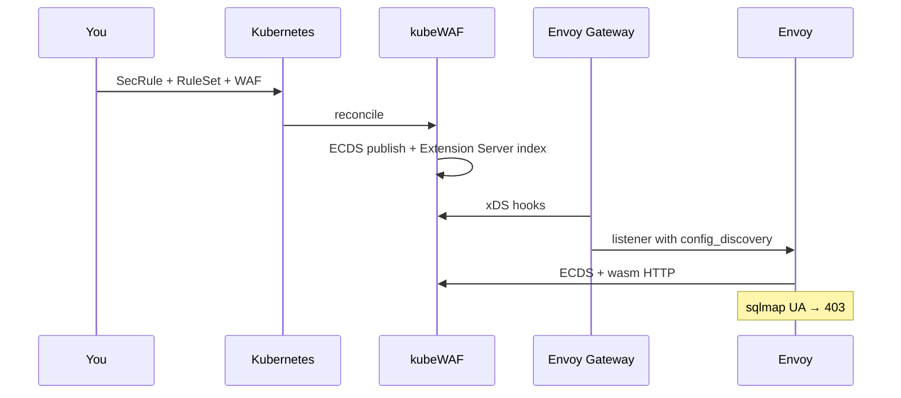

# Quick Start

Get a working WAF-protected HTTP service in under 10 minutes.

## Assumptions

- You have [installed the operator](installation.md) with a wasm binary (`dataplane.wasmSourceURL` or similar)
- You use **Envoy Gateway** for this walkthrough (Istio/Cilium: see [provider guides](../operator/dataplane-ecds.md))
- Envoy Gateway **extensionManager** points at kubeWAF port **5005** ([setup](../operator/envoy-gateway.md#configure-envoy-gateway-extension-server))

## 1. Install Envoy Gateway (if not already present)

```bash
helm install eg oci://docker.io/envoyproxy/gateway-helm \
  --version v1.8.0 \
  --namespace envoy-gateway-system \
  --create-namespace
```

Wait for it to be ready:

```bash
kubectl wait --timeout=5m -n envoy-gateway-system deployment/envoy-gateway --for=condition=Available
```

Configure the EG Extension Server as described in the [Envoy Gateway guide](../operator/envoy-gateway.md), then restart Envoy Gateway.

## 2. Create a simple Backend Application

We'll use a basic `httpbin` pod as our protected backend.

```yaml
# backend.yaml
apiVersion: v1
kind: Namespace
metadata:
  name: demo
---
apiVersion: v1
kind: Pod
metadata:
  name: httpbin
  namespace: demo
  labels:
    app: httpbin
spec:
  containers:
  - name: httpbin
    image: kennethreitz/httpbin
    ports:
    - containerPort: 80
---
apiVersion: v1
kind: Service
metadata:
  name: httpbin
  namespace: demo
spec:
  selector:
    app: httpbin
  ports:
  - port: 80
    targetPort: 80
```

Apply it:

```bash
kubectl apply -f backend.yaml
```

## 3. Create a Gateway and HTTPRoute (standard Gateway API)

```yaml
# gateway.yaml
apiVersion: gateway.networking.k8s.io/v1
kind: Gateway
metadata:
  name: demo-gateway
  namespace: demo
spec:
  gatewayClassName: eg
  listeners:
  - name: http
    port: 80
    protocol: HTTP
    allowedRoutes:
      namespaces:
        from: Same
---
apiVersion: gateway.networking.k8s.io/v1
kind: HTTPRoute
metadata:
  name: httpbin
  namespace: demo
spec:
  parentRefs:
  - name: demo-gateway
  hostnames:
  - "demo.local"
  rules:
  - matches:
    - path:
        type: PathPrefix
        value: /
    backendRefs:
    - name: httpbin
      port: 80
```

Apply:

```bash
kubectl apply -f gateway.yaml
```

## 4. Define a Simple Security Rule

Let's create a rule that blocks requests containing a known malicious pattern in the `User-Agent`.

```yaml
# rule-block-bad-ua.yaml
apiVersion: seclang.kubewaf.io/v1beta1
kind: SecRule
metadata:
  name: block-bad-user-agent
  namespace: demo
  labels:
    app: demo-waf
spec:
  secLangRules:
  - metadata:
      id: 100001
      phase: "1"
      message: "Blocked malicious User-Agent"
      severity: "ERROR"
      tags:
        - "attack-generic"
    conditions:
    - variables:
      - name: REQUEST_HEADERS
        collection: User-Agent
      operator:
        name: rx
        value: (?:nikto|sqlmap|nessus|openvas)
    actions:
      disruptive:
        disruptiveActionType: deny
      status:
        statusActionType: "403"
      message: "Malicious scanner detected"
```

Apply the rule:

```bash
kubectl apply -f rule-block-bad-ua.yaml
```

## 5. Group the Rule into a RuleSet

```yaml
# ruleset-demo.yaml
apiVersion: waf.kubewaf.io/v1beta1
kind: RuleSet
metadata:
  name: demo-rules
  namespace: demo
spec:
  ruleRefs:
  - kind: SecRule
    group: seclang.kubewaf.io
    version: v1beta1
    selector:
      matchLabels:
        app: demo-waf
```

Apply:

```bash
kubectl apply -f ruleset-demo.yaml
```

## 6. Attach WAF Policy to Your Route
## 6. Attach WAF Policy to Your Gateway

```yaml
# waf-policy.yaml
apiVersion: waf.kubewaf.io/v1beta1
kind: WAF
metadata:
  name: demo-waf
  namespace: demo
spec:
  engine: ModSecurity
  provider:
    type: EnvoyGateway
  parentRefs:
    targetRef:
      group: gateway.networking.k8s.io
      kind: Gateway
      name: demo-gateway

  ruleRefs:
  - kind: RuleSet
    name: demo-rules
    namespace: demo
    group: waf.kubewaf.io
    version: v1beta1

  crsEnable: false
  logLevel: 4
```

Apply:

```bash
kubectl apply -f waf-policy.yaml
kubectl get waf demo-waf -n demo -o yaml   # Ready, ecdsResourceName, slotKind=ExtensionServer
```

## 7. Test the Protection

```bash
# Find the Envoy proxy Service created by Envoy Gateway
kubectl get svc -n envoy-gateway-system
```

Send a normal request:

```bash
curl -H "Host: demo.local" http://<envoy-svc-or-port-forward>/get
```

Blocked User-Agent:

```bash
curl -H "Host: demo.local" -H "User-Agent: sqlmap/1.0" http://<envoy>/get -I
```

You should receive **403 Forbidden** from the WAF (modsecurity-proxy-wasm).

## 8. Enable the OWASP Core Rule Set (optional)

```bash
kubectl patch waf demo-waf -n demo --type merge -p '{"spec":{"crsEnable":true}}'
```

The operator publishes a new ECDS snapshot (no slot rewrite). CRS setup ordering and optional `spec.crs` tuning are applied automatically.

## What just happened?



1. Structured `SecRule` in Git-friendly YAML  
2. Grouped into a `RuleSet`  
3. `WAF` attached to the Gateway  
4. Config pushed over **ECDS**; EG Extension Server installed the filter stub  
5. modsecurity-proxy-wasm blocks scanners before the app  

## Next steps

- [Architecture diagrams](../concepts/architecture.md)  
- [Writing rules](../operator/writing-rules.md) · [CRS](../operator/using-crs.md)  
- Other providers: [Istio](../operator/istio.md) · [Cilium](../operator/cilium.md)  
- [WAF CRD reference](../reference/crds/waf.md)

Congratulations — you have a Kubernetes-native, multi-gateway WAF path.
