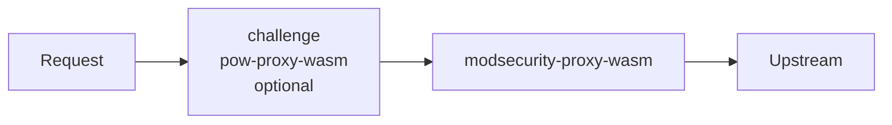

# Wasm engines: modsecurity-proxy-wasm and Challenge (PoW)

kubeWAF is built around **modsecurity-proxy-wasm** — a Proxy-Wasm filter with
embedded OWASP CRS — plus an optional **browser proof-of-work** filter from
**pow-proxy-wasm**. Both live in this monorepo and are published over ECDS by
the operator.

| Module | Path | Role |
|--------|------|------|
| **modsecurity-proxy-wasm** | [`modsecurity-proxy-wasm/`](../../modsecurity-proxy-wasm/README.md) | WAF engine (SecLang + embedded CRS) |
| **pow-proxy-wasm** (challenge) | [`pow-proxy-wasm/`](../../pow-proxy-wasm/README.md) | Stateless PoW challenge **before** the WAF |



## WAF engine (modsecurity-proxy-wasm)

Set on the `WAF` resource (recommended / product default in docs):

```yaml
apiVersion: waf.kubewaf.io/v1beta1
kind: WAF
metadata:
  name: shop-waf
  namespace: shop
spec:
  engine: ModSecurity
  provider:
    type: EnvoyGateway
  parentRefs:
    targetRef:
      group: gateway.networking.k8s.io
      kind: Gateway
      name: external
  crsEnable: true
  ruleRefs:
  - kind: RuleSet
    name: shop-rules
```

### How config reaches the filter

The operator builds the same JSON shape the module expects:

```json
{
  "default_directives": "default",
  "directives_map": {
    "default": [
      "SecRuleEngine On",
      "SecDebugLogLevel 3",
      "Include @crs-setup-conf",
      "Include @owasp_crs/*.conf",
      "..."
    ]
  },
  "metric_labels": {
    "owner": "modsecurity-proxy-wasm",
    "identifier": "edge"
  }
}
```

- **CRS** is **embedded in the wasm binary** (virtual includes such as
  `@owasp_crs/*.conf`, `@crs-setup-conf`, `@demo-conf`).
- **User RuleSets** from kubeWAF are appended as SecLang directives — no need to
  ship large CRS ConfigMaps.
- Config is pushed via **ECDS**; Envoy loads the binary from the operator
  (or `spec.wasmHTTP`).

Serve path on the operator:

```text
GET /wasm/modsecurity-proxy-wasm.wasm
```

## Optional Proof-of-Work challenge (pow-proxy-wasm)

Runs **before** the WAF filter when `spec.challenge` is set:

```yaml
spec:
  engine: ModSecurity
  challenge:
    enabled: true
    secret: "use-a-long-random-hmac-secret-shared-by-all-replicas"
    # or secretRef: { name: challenge-hmac, key: secret }
    baseDifficulty: 18
    minDifficulty: 12
    maxDifficulty: 26
    header: x-challenge-passed
    headerValue: "1"
```

Plugin config mapped to pow-proxy-wasm:

```json
{
  "secret": "...",
  "base_difficulty": 18,
  "min_difficulty": 12,
  "max_difficulty": 26,
  "header": "x-challenge-passed",
  "value": "1"
}
```

ECDS names:

| Filter | Extension name |
|--------|----------------|
| Challenge | `kubewaf/<ns>/<name>/challenge` |
| WAF | `kubewaf/<ns>/<name>` |

Serve path:

```text
GET /wasm/challenge-proxy-wasm.wasm
```

## Building modules

```bash
# From repo root — stages binaries under dist/wasm/
make wasm-build
```

| Artifact | Source |
|----------|--------|
| `dist/wasm/modsecurity-proxy-wasm.wasm` | `modsecurity-proxy-wasm` |
| `dist/wasm/challenge-proxy-wasm.wasm` | `pow-proxy-wasm/build/main.wasm` |

Copy into the operator image or mount at `/wasm/`.

### Operator / Helm knobs

| Flag / Helm value | Module |
|-------------------|--------|
| `--modsecurity-wasm-file` / `dataplane.modsecurityWasmFile` | WAF engine |
| `--modsecurity-wasm-source-url` / `dataplane.modsecurityWasmSourceURL` | WAF download at startup |
| `--challenge-wasm-file` / `dataplane.challengeWasmFile` | PoW |
| `--challenge-wasm-source-url` / `dataplane.challengeWasmSourceURL` | PoW download |

```yaml
dataplane:
  modsecurityWasmFile: /wasm/modsecurity-proxy-wasm.wasm
  challengeWasmFile: /wasm/challenge-proxy-wasm.wasm
  # Or:
  # modsecurityWasmSourceURL: https://…/modsecurity-proxy-wasm.wasm
  # challengeWasmSourceURL: https://…/challenge-proxy-wasm.wasm
```

## Status

```bash
kubectl get waf shop-waf -o jsonpath='{.status.engine}{" challenge="}{.status.challengeEnabled}{"\n"}'
# e.g. ModSecurity challenge=true
```

## Further reading

- [modsecurity-proxy-wasm](../../modsecurity-proxy-wasm/README.md) — build, metrics, CRS, tests  
- [pow-proxy-wasm](../../pow-proxy-wasm/README.md) — challenge behaviour and config  
- [Data plane (ECDS)](dataplane-ecds.md) — how filters attach to Envoy Gateway / Istio / Cilium  
