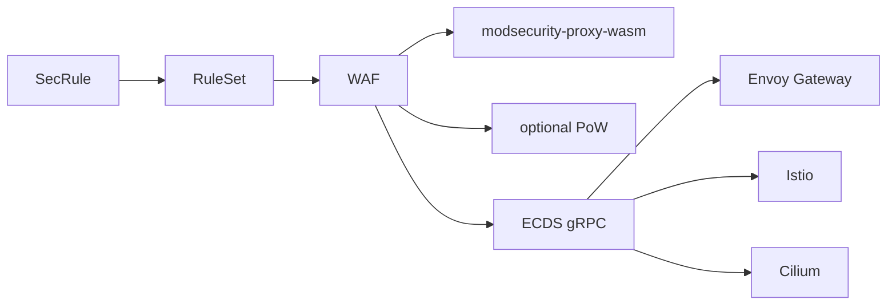

# kubeWAF

**Kubernetes-native Web Application Firewall**

Protect workloads with **ModSecurity-compatible rules** and the OWASP Core Rule Set — defined as version-controlled Custom Resources and enforced by **modsecurity-proxy-wasm** inside Envoy (optional **PoW challenge** via **pow-proxy-wasm**).

!!! warning "Alpha Software"

    **kubeWAF is currently in alpha.**  
    Core features work in real environments, but APIs may still change. Prefer non-critical workloads for production today.

---

## Why kubeWAF?

-   :fontawesome-solid-file-code: **Structured as CRDs**

    Write rules in readable YAML (`SecRule`, `SecAction`) instead of opaque `.conf` files. Full GitOps support.

-   :fontawesome-solid-layer-group: **Powerful RuleSets**

    Group, reuse, and compose rules across namespaces with automatic resolution and status conditions.

-   :fontawesome-solid-plug: **Multi-gateway data plane**

    Push one rule model over **ECDS** to **Envoy Gateway**, **Istio**, and **Cilium** — only the filter slot differs.

-   :fontawesome-solid-shield-halved: **OWASP CRS Included**

    Enable the OWASP Core Rule Set with one flag; CRS is embedded in **modsecurity-proxy-wasm**.

---

## Get Started

-   :fontawesome-solid-rocket: **[Quick Start →](getting-started/quickstart.md)**

    Deploy a protected service end to end.

-   :fontawesome-solid-download: **[Installation →](getting-started/installation.md)**

    Helm install (2 replicas, ECDS, wasm serve).

-   :fontawesome-solid-sitemap: **[Architecture →](concepts/architecture.md)**

    Detailed diagrams of control plane and HA.

-   :fontawesome-brands-github: **[GitHub →](https://github.com/kubewaf-io/kubewaf)**

    Source, issues, and e2e matrix.

---

## Current status (Alpha)

| Status | Feature |
|--------|---------|
| ✅ | `SecRule` + `SecAction` CRDs with SecLang conversion |
| ✅ | `RuleSet` with cross-namespace refs and recursion |
| ✅ | `WAF` + **gRPC ECDS** config push |
| ✅ | Providers: **Envoy Gateway**, **Istio**, **Cilium** |
| ✅ | Engine: **modsecurity-proxy-wasm** (embedded CRS) |
| ✅ | Optional **PoW challenge** (**pow-proxy-wasm**) before WAF |
| ✅ | Operator multi-module wasm HTTP serve |
| ✅ | Multi-replica HA (leader writes, all pods serve dataplane) |
| ✅ | OWASP CRS + declarative tuning |
| ✅ | Provider e2e suite |

**Roadmap highlights:** full `WAFInstance`, validation webhooks, deeper Cilium path.

---

## Documentation map

| Area | Docs |
|------|------|
| Concepts | [Why kubeWAF](concepts/why-kubewaf.md) · [Architecture](concepts/architecture.md) · [Core concepts](concepts/core-concepts.md) |
| Data plane | [ECDS & providers](operator/dataplane-ecds.md) · [Wasm engines](modsecurity-proxy-wasm/README.md) |
| Providers | [Envoy Gateway](operator/envoy-gateway.md) · [Istio](operator/istio.md) · [Cilium](operator/cilium.md) |
| Rules | [Writing rules](operator/writing-rules.md) · [RuleSets](operator/rulesets.md) · [CRS](operator/using-crs.md) |
| Ops | [Installation](getting-started/installation.md) · [Observability](operator/observability.md) · [Troubleshooting](troubleshooting.md) |

---

**Need help?** Open an issue on [GitHub](https://github.com/kubewaf-io/kubewaf/issues) or email [hello@kubewaf.io](mailto:hello@kubewaf.io).
