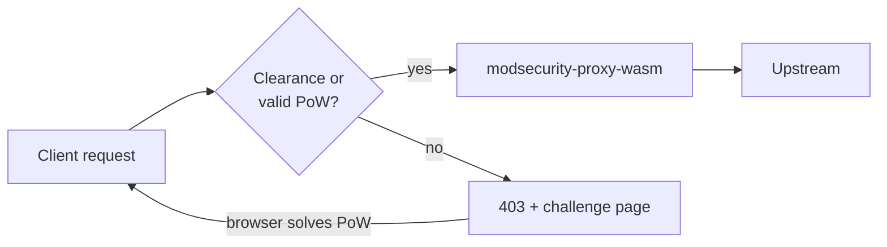

# Challenge Proxy-WASM (pow-proxy-wasm)

**pow-proxy-wasm** (also published as **challenge-proxy-wasm**) is a lightweight,
**stateless** browser **Proof-of-Work (PoW)** filter for Envoy and Envoy-based
data planes (Envoy Gateway, Istio, Cilium Gateway, plain Envoy).

In kubeWAF it is optional and runs **before** [modsecurity-proxy-wasm](../modsecurity-proxy-wasm/README.md).
Source lives at [`pow-proxy-wasm/`](../../pow-proxy-wasm/) in this monorepo.

| | |
|--|--|
| **Language** | Go (`proxy-wasm-go-sdk`, `GOOS=wasip1`) |
| **Artifact** | `challenge-proxy-wasm.wasm` |
| **Serve path** | `GET /wasm/challenge-proxy-wasm.wasm` |
| **ECDS name** | `kubewaf/<namespace>/<waf-name>/challenge` |



---

## When to use it

| Use case | Fit |
|----------|-----|
| Cheap bots / scrapers without a full JS runtime | Strong |
| Absorb bursty unauthenticated traffic before the WAF | Strong |
| Rate-limit adjacent “pay with CPU” gate | Strong |
| Hard identity / anti-account-takeover | Weak — use auth instead |
| Strict one-time tokens with cluster shared state | Not this design |

Place it **after** coarse rate limiting and **before** the WAF / auth filters so
only traffic that paid for a solve hits expensive rule evaluation.

---

## How it works

### Request path

1. **Clearance cookie** (`challenge-clearance`) present and valid  
   → continue (HMAC + expiry + optional IP bind).
2. Else **one-shot PoW cookies** (`challenge`, `challenge-sig`, `challenge-nonce`)  
   or **`challenge-token`** header JSON valid  
   → continue, and on the response mint clearance / drop solve cookies.
3. Else **issue a new challenge**: HTTP **403**, HTML solver page, signed
   challenge cookies. Browser solves, sets nonce, reloads.

There is **no POST verify endpoint**. The browser only sets cookies and reloads;
the filter verifies on the next request.

### Cryptography

| Piece | Mechanism |
|-------|-----------|
| Challenge authenticity | HMAC-SHA256 over base64url(challenge payload), secret shared by all replicas |
| PoW | SHA-256(`payload_bytes ‖ BE_uint64(nonce)`) with *N* leading zero bits |
| Clearance | HMAC-SHA256 over base64url(clearance payload); cookie value `body.sig` |

Challenge payload fields (JSON, then base64url):

| Field | Meaning |
|-------|---------|
| `ts` / `exp` | Issued / expiry (unix seconds) |
| `diff` | Difficulty (leading zero bits) |
| `salt` | Random salt |
| `ctx` | Optional client IP |
| `cid` | Optional Envoy `connection.id` (downstream connection bind) |

### Client page

`challenge.html` is **embedded** in the WASM binary (`//go:embed`). It is a
single file: no CDN, fonts, or external scripts. It implements sync SHA-256 in
JS, matches the server bit-check, follows `prefers-color-scheme`, and sets
`challenge-nonce` on success.

---

## Timers and cookies

Solve window and cookie Max-Age are **aligned** so cookies cannot outlive the
signed challenge.

| Credential | Cookie(s) | Lifetime | HttpOnly | Purpose |
|------------|-----------|----------|----------|---------|
| Challenge / solve | `challenge`, `challenge-sig`, `challenge-nonce` | **60s** | No (JS must read) | One-shot PoW window |
| Clearance | `challenge-clearance` | **30 min** | **Yes** | Access after successful solve |

Constants in code: `ChallengeLifetime`, `ClearanceLifetime` (`pow-proxy-wasm/crypt.go`).

**Why clearance?** Replaying the raw PoW triple for half an hour would turn the
solution into a long-lived bearer token. After verify, the filter issues a
separate signed clearance cookie and **deletes** the solve cookies. The PoW
result is no longer the long-lived credential.

Clearance is still a **bearer cookie** (shareable until expiry). IP binding
narrows reuse across clients; true single-use nonces would need shared cluster
state.

Other headers:

| Name | Role |
|------|------|
| `challenge-token` | Optional JSON solution for non-browser clients |
| `x-challenge-difficulty` | Per-request difficulty override (clamped to min/max) |
| `challenge-sig` | Response header exposing signature for non-cookie clients |
| Config `header` / `value` | Optional header injected on successful/pass-through responses |

---

## Client binding (IP + connection.id)

Tokens carry a signed client context checked on verify.

| Token | Fields | Binding |
|-------|--------|---------|
| Challenge (`ctx`, `cid`) | Client IP + Envoy `connection.id` | Same IP; same downstream connection when both sides see a connection id |
| Clearance (`ctx`) | Client IP only | Survives reload and new TCP/TLS connections |

### IP resolution

1. Envoy property `source.address` (TCP peer — best at the edge)
2. Left-most hop of `X-Forwarded-For`
3. `X-Real-IP`
4. Empty → **no** forged `127.0.0.1`; IP binding is skipped rather than shared

Addresses are normalized (`host:port`, `[ipv6]:port`, `net.ParseIP`).

### Connection ID

Envoy exposes `connection.id` (uint) to Wasm — a unique id for the **downstream
connection**, stable for the life of that TCP/TLS session. It is **not** the TLS
protocol session-id (which Wasm attributes do not provide).

- **Challenge / PoW**: `cid` is stored and enforced when both issue and verify
  observe a non-empty id. A full navigation often opens a new connection; the
  embedded page therefore **`fetch()`es the URL before reload** so the solve can
  finish on the original connection and mint IP-only clearance.
- **Clearance**: never includes `cid`, so later requests on new connections still
  pass until expiry.

**Operator duty:** strip or overwrite untrusted `X-Forwarded-For` at the edge
(`use_remote_address`, `xff_num_trusted_hops`, etc.). Spoofable XFF weakens IP
binding.

---

## Configuration

### Plugin JSON (raw Envoy / WASM)

```json
{
  "secret": "your-32+-byte-or-longer-hmac-secret-here-please-change",
  "base_difficulty": 18,
  "min_difficulty": 12,
  "max_difficulty": 26,
  "header": "x-challenge-passed",
  "value": "1"
}
```

| Field | Required | Description |
|-------|----------|-------------|
| `secret` | **Yes** (in plugin JSON) | HMAC key, **≥ 32 bytes**. In kubeWAF the operator injects this automatically from a managed Secret; raw Envoy installs must still set it. Plugin **fails to start** if missing or short. |
| `base_difficulty` | No | Default difficulty (default **18** leading zero bits). |
| `min_difficulty` | No | Floor (default **12**). |
| `max_difficulty` | No | Ceiling (default **26**). |
| `header` / `value` | No | Optional response header on pass-through. |

### kubeWAF `WAF` CR

```yaml
apiVersion: waf.kubewaf.io/v1beta1
kind: WAF
metadata:
  name: shop-waf
  namespace: shop
spec:
  engine: ModSecurity
  challenge:
    enabled: true
    # No secret required — the operator generates and manages it.
    baseDifficulty: 18
    minDifficulty: 12
    maxDifficulty: 26
    header: x-challenge-passed
    headerValue: "1"
  provider:
    type: EnvoyGateway
  # ...
```

#### HMAC secret management

| Mode | How |
|------|-----|
| **Default (recommended)** | Controller creates Secret `<waf-name>-challenge-hmac` in the WAF namespace, data key `hmac` (32-byte random, base64url). Owned by the WAF (garbage-collected on delete). Value is stable across reconciles so clearance cookies keep working. |
| **SecretRef** | `spec.challenge.secretRef: { name, key }` — use an existing Secret |
| **Inline** | `spec.challenge.secret` — plaintext override (≥ 32 bytes; mainly for dev) |

Status reports the Secret in use:

```bash
kubectl get waf shop-waf -o jsonpath='{.status.challengeSecretName}{"\n"}'
# e.g. shop-waf-challenge-hmac
```

The operator maps CR fields + resolved HMAC into the plugin JSON and installs the
challenge filter **before** the WAF filter via ECDS. See
[Data plane (ECDS)](dataplane-ecds.md) and [WAF CRD](../reference/crds/waf.md).

---

## Dynamic difficulty

Under load the filter can raise difficulty without shared-state locks on every
request:

1. Each issued challenge increments a **local** counter on the plugin instance.
2. On a **5s tick**, the counter is read and reset; a simple heuristic maps
   recent issue rate → `base + {0…6}` (clamped to min/max).
3. Result is cached locally and published to shared data for other VMs
   (best-effort, last-writer-wins).

Priority when choosing difficulty for a **new** challenge:

1. `x-challenge-difficulty` header (if valid)
2. Dynamic / shared current value
3. Config `base_difficulty`

Heuristics are starting points — tune under real traffic.

Rough client cost (order of magnitude, depends on device):

| Difficulty (zero bits) | Expected SHA-256 tries |
|------------------------|-------------------------|
| 12 | ~4k |
| 18 | ~260k |
| 22 | ~4M |
| 26 | ~67M |

---

## Security model

| Guarantee | Status |
|-----------|--------|
| Stateless multi-replica (shared secret only) | Yes |
| Challenge cannot be forged without secret | Yes (HMAC) |
| Browser must spend CPU for a solve | Yes (PoW) |
| Secret required at startup | Yes (fail closed on config) |
| Solve cookies aligned with challenge expiry | Yes (60s) |
| Long-lived credential is clearance, not raw PoW | Yes |
| Clearance not readable by page JS | Yes (HttpOnly) |
| `Secure` cookie flag on HTTPS | Yes (when `:scheme` is https) |
| PoW bound to same downstream connection | Yes — Envoy `connection.id` when available |
| Clearance bound to connection | No — IP only (by design, for reload) |
| True one-time PoW / global anti-replay | No (would need shared used-nonce store) |
| Strong client identity | No — IP (+ conn for PoW) is best-effort |

**Recommendations**

- Prefer the operator-managed Secret (default). To rotate, delete the managed
  Secret and let the controller recreate it (existing clearances invalidate).
- Combine with rate limits, WAF rules, and auth for sensitive routes.
- Do not rely on this alone for API keys or session security.
- Keep Envoy XFF trust configuration correct for your hop topology.

---

## Build and artifacts

Requires Go 1.23+ (module may pin a newer toolchain).

```bash
# Module only
cd pow-proxy-wasm
make build          # → build/main.wasm

# Monorepo — stage both engines under dist/wasm/
make wasm-build
# → dist/wasm/challenge-proxy-wasm.wasm
# → dist/wasm/modsecurity-proxy-wasm.wasm
```

| Target | Output |
|--------|--------|
| `make build` | `pow-proxy-wasm/build/main.wasm` |
| `make oci` / `oci-build` | OCI image / tarball with plugin |
| `make publish` | Push image (`IMAGE=...`) |

Operator / Helm:

| Flag / value | Purpose |
|--------------|---------|
| `--challenge-wasm-file` / `dataplane.challengeWasmFile` | Path on operator disk |
| `--challenge-wasm-source-url` / `dataplane.challengeWasmSourceURL` | Download at startup |

Default serve location inside the operator: `/wasm/challenge-proxy-wasm.wasm`.

---

## Local verification (standalone Envoy)

```bash
cd pow-proxy-wasm
make build
cd example/envoy
docker compose down -v && docker compose up
```

Open http://localhost:8080:

1. First visit → verification page (auto-solves).
2. Reload → backend (httpbin); DevTools shows `challenge-clearance`.
3. Later visits pass until clearance expires (~30 minutes).

The example `envoy.yaml` includes a required plugin `configuration` with a
dev-only secret (≥ 32 bytes). Without config the plugin **does not start**.

See [`pow-proxy-wasm/example/envoy/README.md`](../../pow-proxy-wasm/example/envoy/README.md).

---

## Layout of the module

```text
pow-proxy-wasm/
├── main.go           # Proxy-WASM lifecycle, cookies, IP, difficulty tick
├── crypt.go          # Challenge / clearance generate + verify, timers
├── crypt_test.go     # Unit tests (PoW, clearance, IP helpers)
├── challenge.html    # Embedded solver UI
├── Makefile          # build / oci / publish
├── Dockerfile        # scratch image with plugin.wasm
├── example/envoy/    # docker compose smoke test
└── README.md         # Module readme
```

Hot path notes:

- Cookie parse is index-based (few allocations).
- Difficulty pressure uses local counters; shared data only on tick.
- Success-path logs are debug-level.

---

## Troubleshooting

| Symptom | Check |
|---------|--------|
| Filter never loads / Envoy logs config fail | `secret` missing or &lt; 32 bytes |
| Always 403 challenge page | Cookies blocked; clock skew; IP context changed between issue and solve |
| Works then re-challenges after ~30 min | Clearance expired — expected |
| Works then re-challenges after ~60s without clearance | Clearance not set (response path); check logs for generate errors |
| Context mismatch in logs | Client IP changed (XFF vs direct); normalize hop trust |
| Too hard / too easy for users | Tune `base_difficulty` / min / max; watch dynamic tick logs |
| wasm 404 from operator | `challengeWasmFile` / `challengeWasmSourceURL`; `curl` ECDS `/wasm/challenge-proxy-wasm.wasm` |

Status on a WAF resource:

```bash
kubectl get waf <name> -n <ns> -o jsonpath='{.status.challengeEnabled}{"\n"}'
```

More data-plane checks: [Troubleshooting](../troubleshooting.md),
[Data plane (ECDS)](dataplane-ecds.md).

---

## Further reading

- [Wasm engines overview](../modsecurity-proxy-wasm/README.md) — both filters and how kubeWAF wires them  
- [Data plane (ECDS)](dataplane-ecds.md) — filter attachment and wasm serving  
- [WAF CRD](../reference/crds/waf.md) — `spec.challenge` fields  
- [Module README](../../pow-proxy-wasm/README.md) — build flags and quick start  
- [Architecture](../concepts/architecture.md) — place in the control/data plane  
