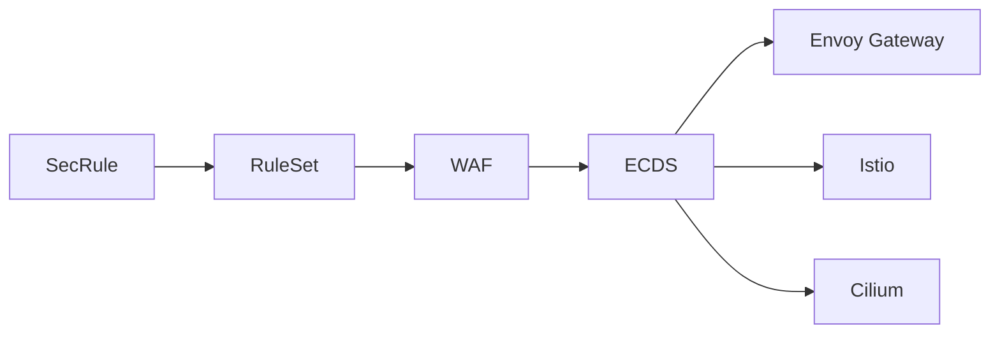

**kubeWAF** is a Kubernetes operator that defines WAF policy as Custom Resources
and enforces it inside Envoy — across **Envoy Gateway**, **Istio**, and **Cilium**.

Rules are ModSecurity-compatible SecLang (structured YAML) plus optional
**OWASP CRS**. Evaluation runs in **modsecurity-proxy-wasm**; you can add an
optional **PoW challenge** in front via `spec.challenge` on the `WAF` resource.

<Callout type="warn" title="Alpha Software">
**kubeWAF is currently in alpha.**  
Core features work in real environments, but APIs may still change. Prefer non-critical workloads for production today.
</Callout>

---

## Why kubeWAF?

<Cards>
  <Card title="Structured as CRDs">
    Write rules in readable YAML (`SecRule`, `SecAction`) instead of opaque `.conf` files. Full GitOps support.
  </Card>
  <Card title="Powerful RuleSets">
    Group, reuse, and compose rules across namespaces with automatic resolution and status conditions.
  </Card>
  <Card title="Multi-gateway data plane">
    Push one rule model over **ECDS** to **Envoy Gateway**, **Istio**, and **Cilium** — only the filter slot differs.
  </Card>
  <Card title="CRS + optional challenge">
    Enable OWASP CRS with one flag; optionally put a PoW challenge in front of the WAF.
  </Card>
</Cards>

---

## Get started

<Cards>
  <Card title="Quick Start" href="/docs/kubewaf/getting-started/quickstart">
    Deploy a protected service end to end.
  </Card>
  <Card title="Installation" href="/docs/kubewaf/getting-started/installation">
    Helm install (replicas, ECDS, wasm serve).
  </Card>
  <Card title="Architecture" href="/docs/kubewaf/concepts/architecture">
    Control plane, data plane, and HA.
  </Card>
  <Card title="GitHub" href="https://github.com/kubewaf-io/kubewaf">
    Source, issues, and e2e matrix.
  </Card>
</Cards>

---

## Common tasks

| Task | Doc |
|------|-----|
| Write custom rules | [Writing security rules](/docs/kubewaf/operator/writing-rules) |
| Enable OWASP CRS | [Using CRS](/docs/kubewaf/operator/using-crs) |
| Enable PoW challenge | [Proof-of-Work challenge](/docs/kubewaf/operator/challenge) |
| Pick / override the WAF engine | [WAF engine](/docs/kubewaf/operator/engine) |
| Wire Envoy Gateway | [Envoy Gateway](/docs/kubewaf/operator/envoy-gateway) |
| Metrics and dashboards | [Observability](/docs/kubewaf/operator/observability) |

---

## Current status (Alpha)

| Status | Feature |
|--------|---------|
| ✅ | `SecRule` + `SecAction` CRDs with SecLang conversion |
| ✅ | `RuleSet` with cross-namespace refs and recursion |
| ✅ | `WAF` + **gRPC ECDS** config push |
| ✅ | Providers: **Envoy Gateway**, **Istio**, **Cilium** |
| ✅ | Engine: **modsecurity-proxy-wasm** (embedded CRS) |
| ✅ | Optional **PoW challenge** (`spec.challenge`) |
| ✅ | Multi-replica HA (leader writes, all pods serve dataplane) |
| ✅ | Provider e2e suite |

**Roadmap highlights:** full `WAFInstance`, validation webhooks, deeper Cilium path.

---

## Other documentation roots

This site has **three separate docs roots** (switch tabs in the sidebar):

| Root | URL | About |
|------|-----|--------|
| **kubeWAF** (this tree) | [`/docs/kubewaf`](/docs/kubewaf) | Operator, CRDs, providers |
| **modsecurity-proxy-wasm** | [`/docs/modsecurity-proxy-wasm`](/docs/modsecurity-proxy-wasm) | WAF engine project |
| **pow-proxy-wasm** | [`/docs/pow-proxy-wasm`](/docs/pow-proxy-wasm) | PoW challenge project |

Operator-facing engine usage stays here:
[engine](/docs/kubewaf/operator/engine) · [challenge](/docs/kubewaf/operator/challenge).

---

**Need help?** Open an issue on [GitHub](https://github.com/kubewaf-io/kubewaf/issues) or email [hello@kubewaf.io](mailto:hello@kubewaf.io).
