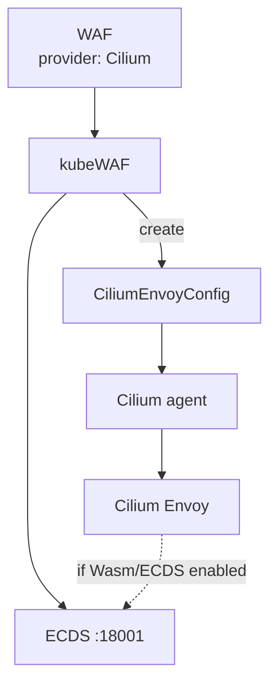
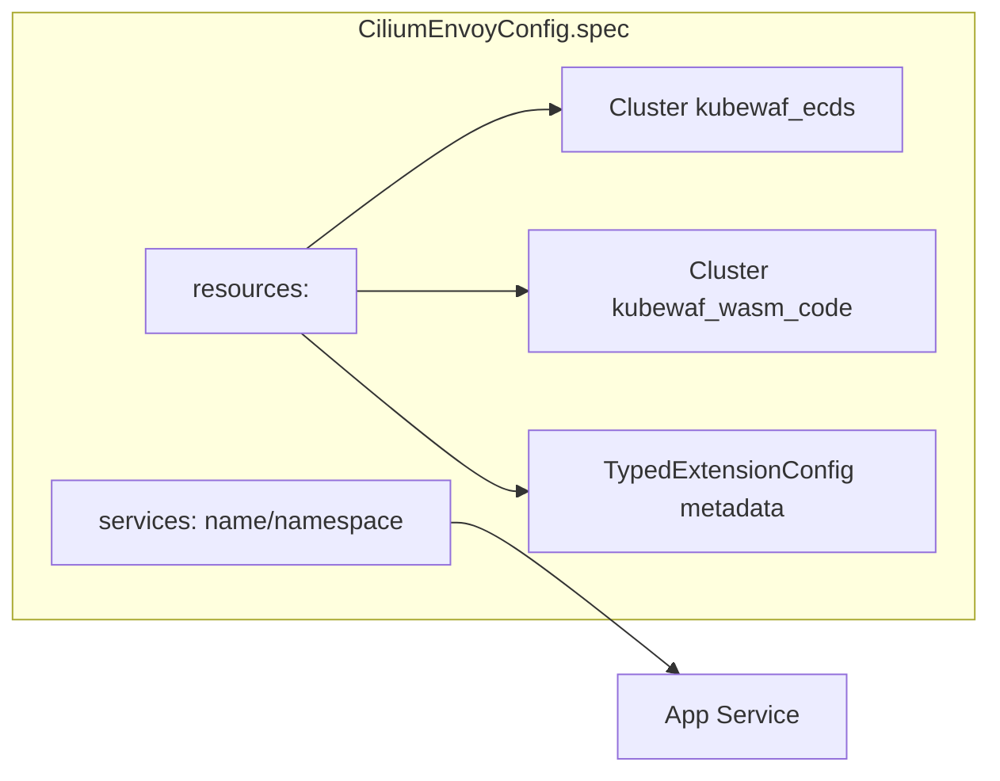

Use kubeWAF with **Cilium** L7 / Gateway API. The operator creates a
**CiliumEnvoyConfig (CEC)** that documents ECDS connectivity and attaches to a
Kubernetes Service.

<Callout type="warn" title="Envoy feature set">
Cilium ships a **minimal Envoy**. Wasm and ECDS availability depend on your
Cilium version and build options. kubeWAF always creates the CEC slot; full
request blocking requires a Cilium data plane that can load the filter.
</Callout>


## How it works





## Prerequisites

- Cilium with Envoy / L7 proxy (and ideally Gateway API if you use Gateways)
- CRD `ciliumenvoyconfigs.cilium.io`
- kubeWAF operator with ECDS + wasm
- A **Service** to attach the CEC to (usually your app or gateway Service)

## Example

```yaml
apiVersion: waf.kubewaf.io/v1beta1
kind: WAF
metadata:
  name: shop-waf
  namespace: shop
spec:
  provider:
    type: Cilium
    cilium:
      serviceName: shop-frontend
      serviceNamespace: shop
  parentRefs:
    targetRef:
      group: gateway.networking.k8s.io
      kind: Gateway
      name: demo-gateway
  ruleRefs:
  - kind: RuleSet
    name: shop-rules
  crsEnable: false
  logLevel: 3
```

### Resulting object

```text
CiliumEnvoyConfig/kubewaf-shop-waf  (namespace shop)
```

Status:

| Field | Expected |
|-------|----------|
| `status.provider` | `Cilium` |
| `status.slotKind` | `CiliumEnvoyConfig` |
| `status.slotName` | `kubewaf-shop-waf` |

```bash
kubectl get cec -n shop
kubectl get ciliumenvoyconfig kubewaf-shop-waf -n shop -o yaml
```

## Capabilities matrix (practical)

| Capability | Typical status |
|------------|----------------|
| CEC created by kubeWAF | Always |
| ECDS clusters in CEC | Always |
| Wasm filter enforcement | Depends on Cilium Envoy build |
| Gateway API GatewayClass `cilium` | Optional; install Gateway API + enable Cilium Gateway |

## Debugging

1. **CEC not created** — RBAC for `cilium.io/ciliumenvoyconfigs`; operator logs
2. **Service not proxied** — wrong `cilium.serviceName` / namespace
3. **No blocking** — verify Cilium Envoy supports Wasm; check agent logs
4. **Experimental traffic e2e** — `E2E_CILIUM_TRAFFIC=true` in [e2e suite](https://github.com/kubewaf-io/kubewaf/blob/main/test/e2e/README.md)

## Future directions

- ExtProc-based path for clusters without Wasm
- Tighter Gateway API attachment once Cilium exposes a stable filter policy API

## Related

- [Data plane (ECDS)](dataplane-ecds)
- [Architecture](../concepts/architecture)
- [Cilium Envoy docs](https:/.cilium.io/en/stable/network/servicemesh/envoy/)
