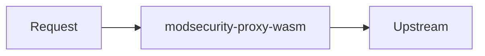

**modsecurity-proxy-wasm** is a [Proxy-Wasm](https://github.com/proxy-wasm/spec) HTTP
filter that runs **ModSecurity** inside Envoy (`envoy.wasm.runtime.v8`) with
**OWASP CRS** embedded in the binary.

| | |
|--|--|
| **Repository** | [github.com/kubewaf-io/modsecurity-proxy-wasm](https://github.com/kubewaf-io/modsecurity-proxy-wasm) |
| **Role** | Evaluate SecLang / CRS against request and response traffic |
| **Runtime** | Envoy Wasm V8 only |

This is a **standalone documentation root** for the engine project.

- **Using the engine from Kubernetes?** See the [kubeWAF docs](/docs/kubewaf) —
  especially [WAF engine](/docs/kubewaf/operator/engine).
- **Running without Kubernetes?** See [Standalone](/docs/modsecurity-proxy-wasm/standalone).

## Pages in this root

<Cards>
  <Card title="Configuration" href="/docs/modsecurity-proxy-wasm/configuration">
    Plugin JSON, virtual CRS includes, metrics, fail-closed behaviour.
  </Card>
  <Card title="Standalone Envoy" href="/docs/modsecurity-proxy-wasm/standalone">
    Build, run, and smoke-test without Kubernetes.
  </Card>
</Cards>
