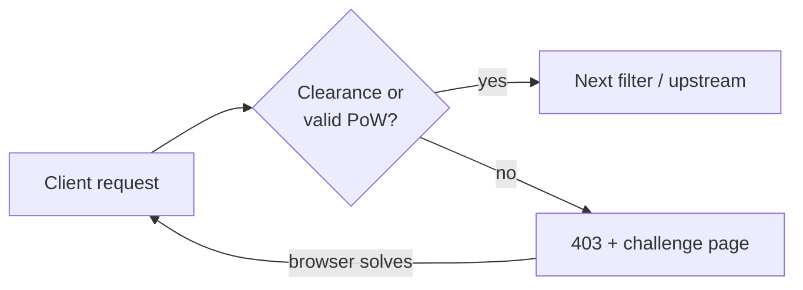

**pow-proxy-wasm** (published artifact: **challenge-proxy-wasm**) is a lightweight,
**stateless** browser **Proof-of-Work (PoW)** filter for Envoy and Envoy-based
data planes.

| | |
|--|--|
| **Repository** | [github.com/kubewaf-io/pow-proxy-wasm](https://github.com/kubewaf-io/pow-proxy-wasm) |
| **Language** | Go (`proxy-wasm-go-sdk`, `GOOS=wasip1`) |
| **Artifact** | `challenge-proxy-wasm.wasm` |

This is a **standalone documentation root** for the challenge filter.

- **Enabling challenge on a kubeWAF `WAF` resource?** Use the
  [kubeWAF challenge guide](/docs/kubewaf/operator/challenge) (`spec.challenge` properties).
- **Filter internals / standalone Envoy?** Stay in this tree.

## Pages in this root

<Cards>
  <Card title="How it works" href="/docs/pow-proxy-wasm/how-it-works">
    Request path, cookies, crypto, IP binding, dynamic difficulty.
  </Card>
  <Card title="Configuration" href="/docs/pow-proxy-wasm/configuration">
    Raw plugin JSON fields for Envoy.
  </Card>
  <Card title="Standalone Envoy" href="/docs/pow-proxy-wasm/standalone">
    Build, docker-compose example, layout.
  </Card>
  <Card title="Troubleshooting" href="/docs/pow-proxy-wasm/troubleshooting">
    Common failure modes for the filter itself.
  </Card>
</Cards>
